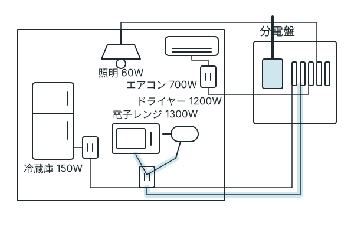
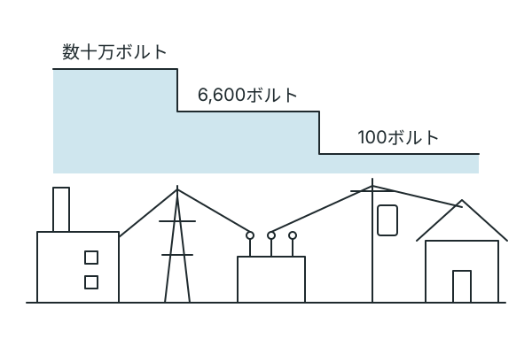
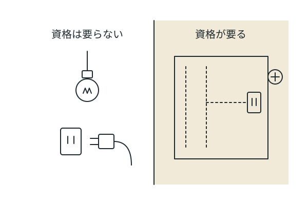
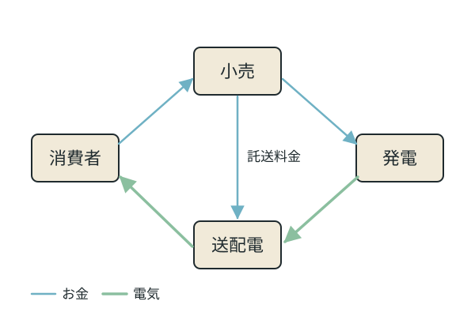

# 部屋の電気から、どこへでも

いま座っている部屋を、ぐるっと見回してみてください。照明、エアコン、冷蔵庫、充電中のスマートフォン、たぶんパソコンかテレビ。電気を使っていないものを探すほうが難しいはずです。

その電気、どこから来て、誰が運んで、なぜ壁の中に隠れていて、たまにブレーカーが落ちるのか。全部を知る必要はありません。でも、どれか一つに引っかかったら、そこがあなたの入口かもしれません。

---

## まず足元から: ブレーカーはなぜ落ちる

家の分電盤(ブレーカーの箱)には、家全体の契約アンペアを守る大きなスイッチと、部屋ごと・回路ごとに分かれた小さなスイッチ(多くは1回路20アンペア)が並んでいます。小さいほうが落ちるのは、その回路に同時に流れる電気が上限を超えたときです。

家電のワット数を100で割ると、おおよそのアンペアになります。ドライヤーと電子レンジを同じ回路で同時に使えば、それだけで20アンペアに届きます。コンセントが壁の何箇所かに分かれているのは、電気の通り道を分けるためで、電子レンジやエアコンのそばにコンセントが一つだけあるのは、専用の回路を引いてあることが多いからです。差し込み口ひとつは合計1500ワット(15アンペア)まで。大きい家電は別々のコンセント、できれば別々の回路に。それだけで落ちる回数が減ります。

今日できることは一つだけ。分電盤の蓋を開けて、どのスイッチがどの部屋に対応しているかを見る。それから、ワット数の大きい家電が同じ回路に集まっていないかを確かめる。集まっていたら、どれかを別の回路のコンセントに移す。配線には触れないので資格は要りません。

分電盤を眺めた時点で、あなたはもう「家の電気の地図」を読み始めています。

---

## 壁の向こう、電気はどこから来るのか

分電盤の上には、外から入ってくる太い線があります。その先をたどると、電柱の上の変圧器、街の配電線、変電所、送電線、そして発電所。

高い電圧で運ぶのは、電線で失われる分を減らすためです。この道を管理しているのは、地域ごとに一社ずつ決まっている一般送配電事業者(全国で10社)で、あなたがどの電力会社と契約していても、通る電線は同じです。

発電所そのものが気になった人には、火力、水力、太陽光、原子力がそれぞれどう電気をつくっているか、という話が続きます。

---

## 壁の中に、自分で手を入れる

コンセントの位置に「ここにあればいいのに」と思ったことはありませんか。壁の中の配線を変える作業は、電気工事士法という法律で、資格を持つ人にしか認められていません。ブレーカーを切って電気が流れていない状態でも同じです。

第二種電気工事士は、一般の住宅や小さな店舗(600ボルト以下で受電する設備)の工事ができる国家資格です。受験資格に年齢や学歴や経験の制限はなく、試験は年に2回。学科試験と、実際に配線を組み立てる技能試験の二段構えで、受験手数料は11,100円(2026年度、ネット申込み)。過去問と技能試験の候補問題は、試験センターが無料で公開しています。

仕事として見ると、電気工事士が属する職業分類の全国平均年収は628.1万円、有効求人倍率は3.84倍(2026年9月時点の公表値)。ただし平均は平均で、経験の浅いうちは低めから始まり、地域と勤め先で幅があります。

「手に職」という言葉のほうに引っかかった人には、配管や溶接や調理のように資格が仕事に直結する別の分野の話が続きます。資格そのものが気になった人は、過去問を一回分眺めてみると、届く距離の見当がつきます。

---

## 灯りをつけた人たちの、いくつかの顔

電気といえば[エジソン](guide:edison_iteration)、と言う人は多いでしょう。白熱電球を実用にした人、蓄音機をつくった人、千を超える特許を持つ人。でもそれは、エジソンの顔の一つにすぎません。

エジソンには、発明を売る会社をつくって経営者として振る舞った顔があります。その会社は他社と合併して、いまも続く大企業の源流になりました。一方で、電気を送る方式をめぐって、自分の直流方式が別の技術者たちの交流方式に敗れた顔もあります。学校になじめず、母親から家で学んだ子どもの顔もあります。研究所で何百回も試作を繰り返す、地味な反復の顔もあります。

どの顔に反応するかは、人によって違います。経営者の顔に引っかかった人と、負けた顔に引っかかった人と、反復の顔に引っかかった人は、たぶん、それぞれ別の入口の前に立っています。

交流方式でエジソンに勝った技術者たち、電気と磁気の関係を実験で見つけた人、蒸気機関を改良して「ワット」に名を残した人。それぞれに、また別のいくつかの顔があります。

---

## 請求書の向こう側

毎月の電気料金の明細には、契約しているアンペア数、使った電力量、そして「託送」や「燃料費調整」といった見慣れない言葉が並んでいます。電気の仕事は、法律で三つに分かれています。つくる「発電」、運ぶ「送配電」、契約して請求する「小売」。2016年4月から小売は誰でも参入できるようになり、家庭も電力会社を選べるようになりました。

託送料金は電線を使う分で、同じ地域ならどの小売事業者を選んでも同額です。停電したときの連絡先は送配電事業者、料金や契約のことは小売事業者。窓口が違うのは、仕事が分かれているからです。

契約アンペアを下げると基本料金がどう変わるか、料金のうち何が固定で何が変動するのか。明細を手に取ると、そこからまた話が続きます。

---

## この話のもと

数字や制度は、次の場所でたしかめました。名前をタップすると、その場所へ移ります。

- [資源エネルギー庁「電力の小売全面自由化って何?」](https://www.enecho.meti.go.jp/category/electricity_and_gas/electric/electricity_liberalization/what/) — 発電・送配電・小売の三つの部門と、2016年4月の小売全面自由化について。2023年8月30日更新の制度説明
- [資源エネルギー庁「一般送配電事業者」](https://www.enecho.meti.go.jp/category/electricity_and_gas/electric/summary/electric_transmission_list/) — 一般送配電事業者が10社であること。2026年9月2日更新
- [電力広域的運営推進機関「電力ネットワークの仕組み」](https://www.occto.or.jp/grid/public/shikumi.html) — 電圧の区分と、発電所から家までの電気の道について。日付の記載なし、2026年9月14日に閲覧
- [経済産業省「電気工事の安全」](https://www.meti.go.jp/policy/safety_security/industrial_safety/sangyo/electric/detail/koji.html) — 資格がないとできない工事と、資格なしでよい軽微な工事の範囲について。日付の記載なし、2026年9月14日に閲覧
- [電気技術者試験センター「第二種電気工事士試験」](https://www.shiken.or.jp/construction/second/) — 試験の構成、受験資格、年2回の実施、受験手数料について。令和8年度の試験案内
- [厚生労働省 職業情報提供サイト「電気工事士」](https://shigoto.mhlw.go.jp/Occupation/Detail?occupationId=46) — 年収と有効求人倍率について。令和7年の賃金構造基本統計調査と令和7年度の求人統計を加工した値

エジソンの話は、広く知られた伝記的な事実を学習向けにまとめたもので、本人の言葉の引用ではありません。ブレーカーとワット数の話は電気の基本(電力=電圧×電流、家庭用は100ボルト)に基づく一般的な説明で、コンセント一口の定格(15アンペア)は家庭用の配線器具に一般的な値です。分電盤や専用回路の作りは住宅によって違います。

## 編集メモ(公開時には表示しない)

- この記事の目的: 部屋という足元から電気に触れ、資格・電気の道・人物・料金のどれかに興味が動く入口をつくる。読み手は前提を持たない迷子で、5〜10分で読む
- 主軸の確認: 数字・制度・法律はすべて「この話のもと」の一次情報に基づく。「必ず」「誰でも」「稼げる」は不使用
- この記事で選んだ手段(一例): 幹一本と枝四本を一ページに置く。段落の代わりになる図を三点と境目の図を一点、消した段落の位置に全幅で置く。人物の節は既存のガイド画像を脇に小さく置き、エジソンと認識した上で読めるようにする。飾りの挿絵は置かない。出典はリンク付きの箇条書き
- 副軸の扱い: 人物は複数の顔で並べた(目的に合うため)。構造の説明文は置かない。末尾で進むことを強いない
- 制度改定で影響を受けやすい箇所: 受験手数料、統計の数値、一般送配電事業者の社数。年1回の検証を想定
- 2026-09-14 実機確認の反映(第2回)の記録: 冒頭の飾りの図と四つの顔の図を廃止し、部屋の図にワット数を持たせて足元の節に統合、境目の図を壁の断面に作り直した
